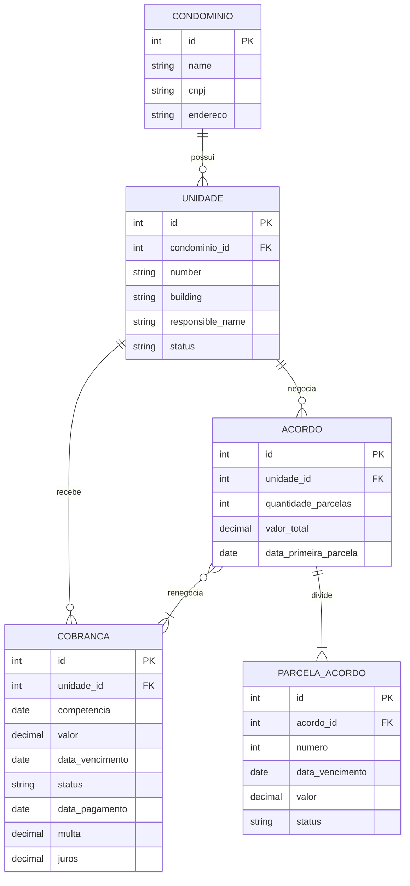

# Sistema de Cobrança de Condomínios

Backend REST para cadastro de condomínios e unidades, emissão e acompanhamento de cobranças, consulta de inadimplência e negociação por acordos parcelados. Este escopo não inclui interface frontend, testes automatizados nem endpoints de dashboards inteligentes.

## Executar localmente

No PowerShell, na raiz do projeto:

```powershell
py -m venv venv
.\venv\Scripts\Activate.ps1
python -m pip install -r requirements.txt
python manage.py migrate
python manage.py createsuperuser
python manage.py runserver
```

A API fica em `http://127.0.0.1:8000/`. O banco padrão é SQLite; o schema é criado pelas migrações em `apps/condominiusSystem/migrations/`. O superusuário pode escrever em todos os recursos. Usuários comuns criados pelo Django Admin podem receber o perfil `Admin` ou `Client`.

## Autenticação JWT

Obtenha os tokens enviando usuário e senha:

```http
POST /auth/token/
Content-Type: application/json

{"username":"admin","password":"sua-senha"}
```

Nas rotas protegidas, envie o token de acesso:

```http
Authorization: Bearer <access>
```

- `POST /auth/token/refresh/`: recebe `{"refresh":"<refresh>"}`.
- `POST /auth/registro/`: cadastra um usuário com perfil `Client`; exige autenticação de `Admin` ou superusuário.
- `GET`, `PUT`, `PATCH` e `DELETE /auth/usuarios/<id>/`: consulta, atualiza ou exclui um usuário; exige `Admin` ou superusuário. A atualização permite alterar `role`, mas não senha nem privilégios de superusuário.
- `GET /auth/me/`: retorna o perfil do usuário autenticado.

O token de acesso dura 30 minutos e o de renovação, 7 dias. Todos os recursos da API exigem autenticação. Usuários `Client` podem consultar; criação, alteração e exclusão exigem perfil `Admin` ou superusuário.

## Endpoints

As coleções oferecem operações REST de listagem, detalhe, criação, atualização e exclusão. Unidades são criadas pela rota aninhada por condomínio descrita abaixo. As listagens são paginadas em grupos de 25 itens.

| Recurso | Endpoint | Filtros |
| --- | --- | --- |
| Condomínios | `/api/condominios/` | `name`, `type_condominious`, `cidade`, `uf` |
| Unidades | `/api/unidades/` | `condominio`, `status`, `building`, `is_active` |
| Cobranças | `/api/cobrancas/` | `condominio`, `unidade`, `status`, `competencia`, `vencimento_de`, `vencimento_ate` |
| Acordos | `/api/acordos/` | `unidade`, `criado_de`, `criado_ate` |
| Parcelas | `/api/parcelas-acordo/` | `acordo`, `status` |

Exemplos:

```http
GET /api/cobrancas/?status=VENCIDO&condominio=3
GET /api/cobrancas/?unidade=10&competencia=2026-09-01
GET /api/acordos/?unidade=10
GET /api/parcelas-acordo/?acordo=4
```

Os parâmetros de relacionamento recebem IDs. Cobranças pendentes com vencimento anterior à data local são classificadas como `VENCIDO` durante a consulta.

### Criar unidade

O condomínio é informado na URL, não no corpo da requisição:

```http
POST /api/condominios/3/unidades/
Content-Type: application/json

{
    "number": "101",
    "building": "A",
    "responsible_name": "Maria Silva",
    "status": "OCUPADO"
}
```

O endpoint retorna `404` se o condomínio não existir e `400` com uma mensagem de validação se já houver uma unidade com o mesmo bloco e número. `POST /api/unidades/` não é mais aceito.

### Criar cobrança

```http
POST /api/cobrancas/
Content-Type: application/json

{
  "unidade_id": 10,
  "competencia": "2026-09-01",
  "valor": "450.00",
  "data_vencimento": "2026-09-10",
  "status": "PENDENTE"
}
```

Para quitar uma cobrança, envie também `status: "PAGO"`, `data_pagamento` e `forma_pagamento` (`BOLETO`, `PIX` ou `CARTAO`). Pagamentos posteriores ao vencimento calculam multa de 2% e juros simples de 0,033% ao dia sobre o valor original. A data de pagamento e a forma são obrigatórias quando a cobrança está paga.

### Criar acordo

```http
POST /api/acordos/
Content-Type: application/json

{
  "unidade_id": 10,
  "cobrancas_ids": [22, 23],
  "quantidade_parcelas": 4,
  "data_primeira_parcela": "2026-10-15"
}
```

Um acordo exige uma ou mais cobranças vencidas e em aberto, todas da mesma unidade e sem outro acordo ativo. As parcelas mensais são geradas automaticamente dentro da mesma transação; eventual diferença de centavos fica na última parcela. A resposta inclui as parcelas geradas.

O status inicial do acordo é `ATIVO`; ele passa para `QUITADO` quando todas as parcelas forem pagas. Um acordo ativo pode ser cancelado com `PATCH /api/acordos/<id>/` enviando `{"status":"CANCELADO"}`. O status quitado não pode ser definido manualmente. As parcelas geradas não podem ser criadas ou excluídas individualmente; use `PATCH /api/parcelas-acordo/<id>/` para registrar o pagamento com `status: "PAGO"` e `data_pagamento`. Regras de domínio inválidas retornam `400` com detalhes por campo; operações de criação ou exclusão individual de parcela retornam `405` com a justificativa.

## Modelo de dados



Uma unidade pertence a exatamente um condomínio. Cobranças e acordos pertencem a uma unidade. Um acordo relaciona uma ou mais cobranças e possui uma ou mais parcelas.

## Requisitos atendidos

### Funcionais

- CRUD de condomínios, unidades, cobranças, acordos e parcelas.
- CNPJ e endereço do condomínio opcionais; bloco e responsável da unidade opcionais; status de unidade `OCUPADO` ou `VAGO`.
- Cobranças com competência, valor, vencimento, status, pagamento, forma, multa e juros.
- Classificação de cobranças vencidas e filtros por condomínio, unidade, status, competência e vencimento.
- Cálculo de encargos por atraso e validação de pagamento.
- Criação de acordos com cobranças da mesma unidade e geração automática de parcelas.
- Autenticação JWT e escrita restrita a administradores.

### Não funcionais

- Django e Django REST Framework, com serializers de modelo, roteadores padrão e `DjangoFilterBackend`.
- SQLite por padrão e schema versionado com migrações.
- Paginação das coleções, validação HTTP 400 e senhas armazenadas com hash do Django.